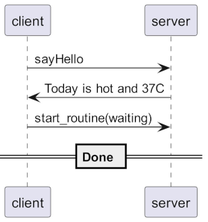

# Logalizer

Helper to Visualize logs


## What you can do

+ Visualize logs
+ Understand logs better
+ Uncover problems

## Demo

This log gets translated to the below sequence diagram

```
2019-07-13 14:29:05:147 [Networking] DisplayClient say_hello: asking to connect to server
2019-07-13 14:29:06:239 [Networking] DisplayClient server_response: Today's is a hot day with a max temperature of 37C possibly
2019-07-13 14:29:06:239 [Networking] DisplayClient start_routine: state=waiting, entering locked state
```



## How it works

Logalizer takes a log file and a config file as input. Logalizer outputs a translated file.

<pre>
 +--------+
 | Config |------------------------.
 +--------+                        |
                                   |
                                   V
 +-------------+            +-------------+            +---------------+
 |  Input Log  |----------->|  Logalizer  |----------->|  Translation  |
 +-------------+            +-------------+            +---------------+
</pre>

The translation can be directly used or fed to another tool for further processing.

## Visualizing

The translated file can be used to generate UML diagrams.

<pre>
  +---------------+          +---------------+          +---------------+
  |  Translation  |--------->|   Plant UML   |--------->|  UML diagram  |
  +---------------+          +---------------+          +---------------+
</pre>

[PlantUML](https://plantuml.com/) and [Mermaid](https://mermaid-js.github.io/mermaid/#/) like tools can convert text into diagrams.

## Usage

```bash
Usage:
  logalizer -c <config> -f <log>
  logalizer -f <log>
  logalizer -h | --help
  logalizer --config-help
  logalizer --version

Options:
  -h --help        Show this screen
  --config-help    Show sample configuration
  --version        Show version
  -c <config>      Translation configuration file. Default is ./config.json
  -f <log>         Log file to be interpreted

Example:
  logalizer -c config.json -f trace.log
  logalizer -f trace.log
```

## Configuring Logalizer

Refer [How To Configure](docs/How-To-Configure.md).

## Build

1. [Install vcpkg](https://vcpkg.io/en/getting-started.html)

2. Build

```bash
cmake --preset ninja-multi-vcpkg
cmake --build --preset ninja-multi-vcpkg-release
```

3. Run Tests

```bash
ctest --preset ninja-multi-vcpkg-release --verbose
```
